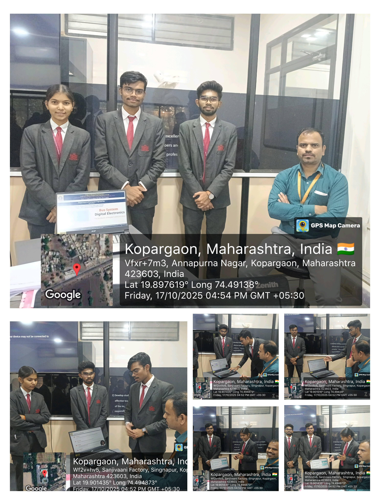

# Digital Electronics and Logic Design Project

# 🧠 Bus Systems in Digital Electronics

---

## 📘 Overview
This project explores the concept of **Bus Systems** in digital electronics — the core of communication between components like the **CPU**, **Memory**, and **Input/Output devices**.  
It highlights how **data**, **address**, and **control** signals flow through buses, ensuring synchronized and efficient performance in a digital system.

---

## 🧩 Abstract
Bus Systems in Digital Electronics are essential for connecting various hardware modules.  
A **bus** acts as a shared pathway for transferring:
- **Data** between devices  
- **Addresses** for identifying locations  
- **Control signals** for coordinating operations  

Together, these buses ensure **reliable**, **fast**, and **scalable** digital circuit performance.

---

## ⚙️ Expected Input
- Digital signals  
- Address lines  
- Control signals  
- Clock pulses  

## 💡 Expected Output
- Reliable data transfer  
- Synchronized communication  
- Efficient overall system performance  

---

## 🧾 Proofs

  
   
  <em>Fig. 3 — Presentation</em>

---

## 👨‍💻 Project Members
| Roll No | PRN No | Name | Email |
|----------|---------|------|--------|
| 66 | 0124UCSM1066 | **Deokar Sai** | saideokar35@gmail.com |
| 67 | 0124UCSM1067 | **Nere Tejas** | tejasnere94@gmail.com |
| 68 | 0124UCSM1068 | **Palande Siddharth** | palandesiddharth011@gmail.com |
| 69 | 0124UCSF1069 | **Gidhad Arti** | artigidhad72@gmail.com |
| 70 | 0124UCSM1070 | **Rashinkar Sanket** | ranshinkarsanket7@gmail.com |

---

## 🧑‍🏫 Guided By
**Prof. P. M. Dhanrao**  
Department of Computer Engineering  
Sanjivani College of Engineering, Kopargaon  

---

## 📚 Academic Info
- **Course:** Digital Electronics & Logic Design (MDCO221)  
- **Year/Semester:** SY(A) – SEM I   
- **Academic Year:** 2025–26  
- **Group ID:** 14  

---

## 🧾 License
This project is part of the **CIA Case Study Activity** for academic purposes only.  
Reproduction or modification should credit the respective authors and **Sanjivani College of Engineering**.

---

  <b>“Connecting logic through buses, powering digital design.”</b>

